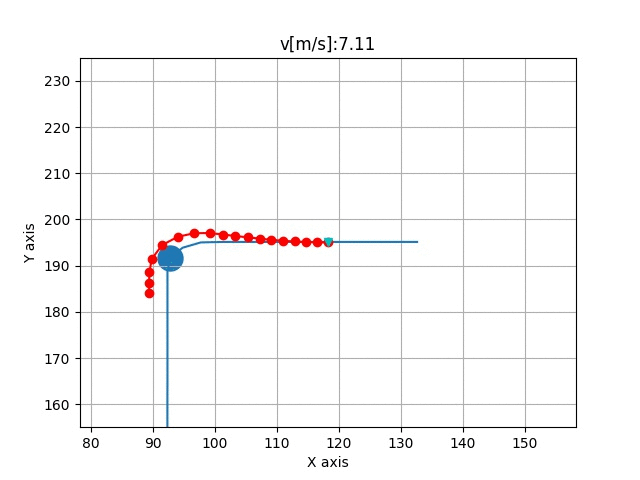
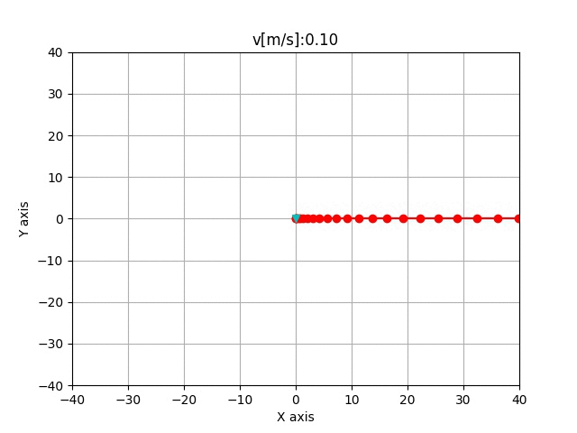
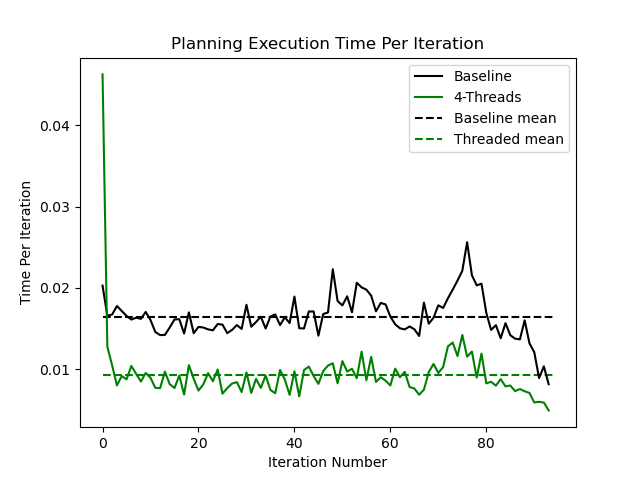
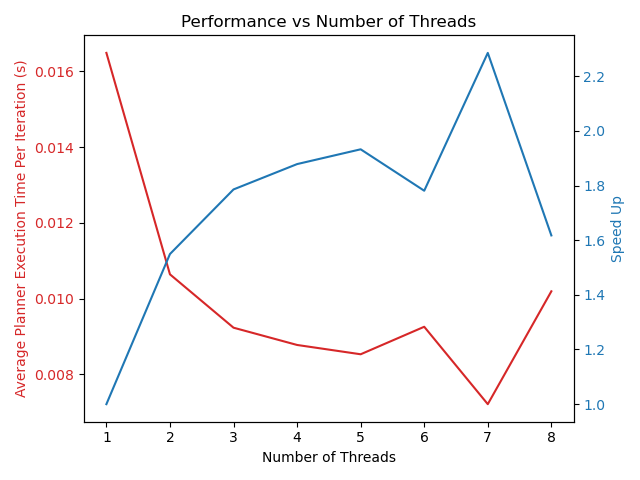

# Frenet Optimal Trajectory



## Overview
This repository contains a fast, C++ implementation of the Frenet Optimal
 Trajectory algorithm with a Python wrapper. It is used as one of the motion planning models in 
 [pylot](https://github.com/erdos-project/pylot), an [erdos](https://github.com/erdos-project) project.
 
Reference Papers:
- [Optimal Trajectory Generation for Dynamic Street Scenarios in a Frenet Frame](https://www.researchgate.net/profile/Moritz_Werling/publication/224156269_Optimal_Trajectory_Generation_for_Dynamic_Street_Scenarios_in_a_Frenet_Frame/links/54f749df0cf210398e9277af.pdf)
- [Optimal trajectory generation for dynamic street scenarios in a Frenet Frame](https://www.youtube.com/watch?v=Cj6tAQe7UCY)

## Profiling
Some basic profiling of the code (same trajectory as demo, 10 obstacles) 
indicates the following expected performance:
```
Average Time: ~7 ms
Max Time: ~20 ms
```

## Setup
```
git clone https://github.com/fangedward/frenet-optimal-trajectory-planner.git
./build.sh
```

## Example Usage
There is a Python wrapper and C++ API. The Python wrapper is located in 
`FrenetOptimalTrajectory/fot_wrapper.py` and the C++ API is under 
`src/FrenetOptimalTrajectory/fot_wrapper.cpp`.
The following command will simulate a simple scenario to run the
 FrenetOptimalTrajectory planning algorithm.
```
python3 FrenetOptimalTrajectory/fot.py
```

To measure speed up with threading:
```
python3 FrenetOptimalTrajectory/fot.py -t 4 -p -c
```

Here are some flags you can pass in:
* `-d`, `--display`, display animation. Ensure you have X11 forwarding enabled if running on a server.
* `-v`, `--verbose`, prints detailed states one each iteration.
* `-s`, `--save`, screenshot each frame and save to `/img/frames`; you can use them to make `.gif`.
* `-t`, `--thread`, set number of threads. Default will be 0 (no threading). Accepts positive integer arguments.
* `-c`, `--compare`, compare threaded program with unthreaded baseline for time profiling.
* `-p`, `--profile`, show a plot of runtime profile across iterations.
* `-f`, `--full`, generate comparisons of runtime and speed up ratio across running planner on different number of threads.


Besides using command line input, you can specify number of threads by going to `fot.py` and editing `num_threads` under `hyperparameters`. To use the single-threaded implementation of the algorithm, set `num_threads` to `0`.

### Speed Up Performance

The above flags are mostly used to visualize the effect of threading. To enable threading, pass in `-t NUM_THREADS` and specify the number of threads you want to use. 

Use the `-c` flag to see a speedup comparison between the threaded version and the baseline single-threaded runtime. The `-p` flag gives you a graph of planner runtime across iterations. Below shows an example of comparing runtime per iteration across iterations for using 4 threads vs a single thread.



To see the performance across using different number of threads, you can use the `-f` flag. Below shows a comparison of Runtime & Speedup using different number of threads, profiled on a 4-Core CPU with 8 logical processors.

